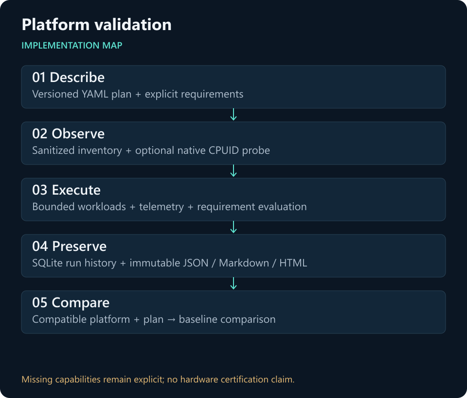
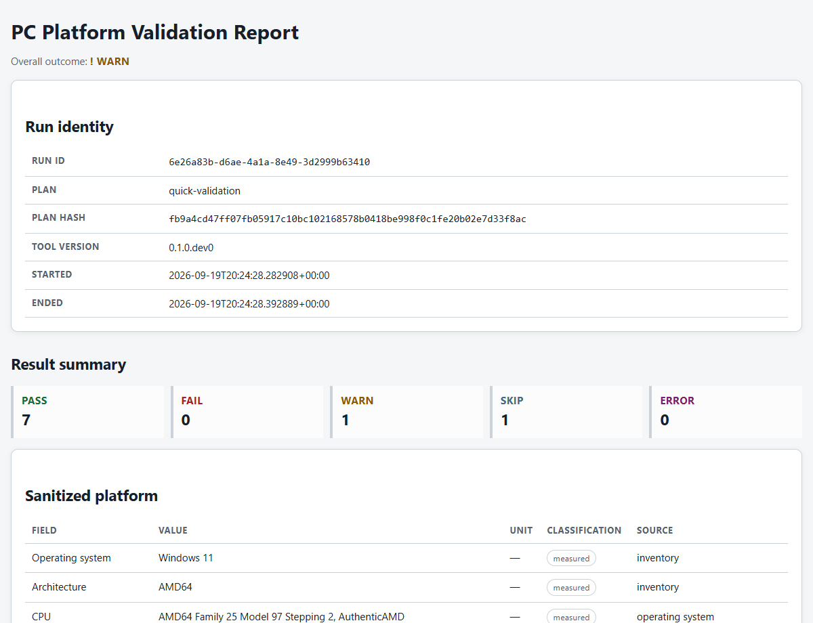
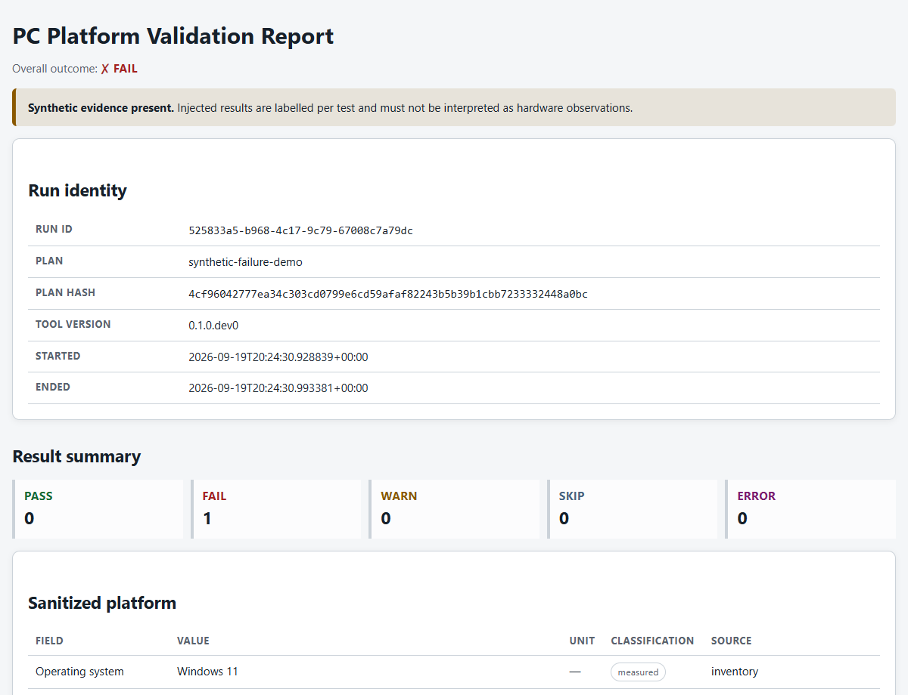

# PC Platform Validation Toolkit

[](https://github.com/KhaiFaw/pc-platform-validation-toolkit/actions/workflows/ci.yml)
[](LICENSE)

A requirements-based command-line toolkit for collecting sanitized PC inventory, running bounded functional validation, preserving evidence, and comparing compatible runs against an immutable known-good baseline.

**Status:** functional MVP, `0.1.0.dev0`. Current reports distinguish measured results, unavailable capabilities and deliberately injected failures.



[Measured report](examples/measured/report.md) · [Injected-failure report](examples/injected/report.md) · [Verification](docs/final-verification.md) · [Portfolio](https://github.com/KhaiFaw)

## Project status

Milestones 0–11 are implemented. The Python toolkit includes inventory, capability discovery, bounded CPU/memory/storage workloads, telemetry, explicit requirement evaluation, SQLite persistence, JSON/Markdown/HTML reports, conservative baseline comparisons, and a software-only fault-injection demonstration. GitHub Actions verifies portable Python behavior and the C++ decoder on Windows and Ubuntu.

Version `0.1.0.dev0` is a functional MVP, not a stable release. On 20 September 2026, a fresh local dependency installation passed 66 tests, lint, formatting and strict typing. The local quick plan returned seven PASS, one WARN and one SKIP; unavailable capabilities remain visible in the result.

The optional native CPUID probe source is complete but has not been compiled on the original development machine because CMake and a C++20 compiler are unavailable there. Missing native or sensor capabilities degrade to explicit WARN or SKIP evidence.

This is a functional validation and engineering-evidence tool. It is not an unrestricted stress test, overclocking utility, universal benchmark, monitoring replacement, or hardware-certification system.

## Engineering problem and contributions

The useful question is whether an explicit requirement holds under a repeatable, resource-bounded test—and whether the evidence can explain a failure later. The project-specific code defines typed plans/results, lifecycle and safety controls, requirement evaluation, immutable artifacts, baseline compatibility and a labelled failure demonstration.

Typer provides the CLI, Pydantic validates models, psutil provides portable observations, Jinja2 renders reports and SQLite stores local history. The optional C++ probe decodes processor information. These dependencies are credited as infrastructure, not claimed as original implementations.

## Current evidence



[Open the measured Markdown report](examples/measured/report.md), or download and open the [self-contained HTML](examples/measured/report.html) locally. The capture used Windows 11, Python 3.12, the checked-in quick plan and no native probe. It contains sanitized configuration details, not usernames or serial numbers.



The [injected report](examples/injected/report.md) deliberately fails a checksum requirement. It proves the software failure/reporting path, not a faulty CPU. [Capture notes](examples/CAPTURE_NOTES.md) distinguish measured observations, missing capabilities and the baseline self-comparison.

## Architecture

```text
YAML plan -> runner -> bounded workloads -> requirement evaluation
                |              |
          inventory/probe   telemetry sampler
                |              |
                +-> canonical result -> SQLite + immutable artifacts
                                           |
                              reports / baselines / comparison
```

Collectors report observations and unavailable capabilities; evaluators assign outcomes only against explicit requirements. Reports are projections of persisted evidence and never rerun workloads. See [architecture.md](docs/architecture.md) and the short records in [docs/decisions](docs/decisions).

## Quick start

Python 3.12 or newer is required.

```powershell
py -3.12 -m venv .venv
.\.venv\Scripts\Activate.ps1
python -m pip install --upgrade pip
python -m pip install -e ".[dev]"

platval doctor
platval inventory
platval run --plan configs/quick.yaml
platval runs list
```

To build the optional native probe after installing CMake and a supported C++20 compiler:

```powershell
.\scripts\build_native.ps1
platval doctor --native-probe cpp\cpuid_probe\build\Release\cpuid_probe.exe
```

## Evidence and baseline workflow

```powershell
platval report <run-id> --format html
platval report <run-id> --format markdown
platval report <run-id> --format json

platval baseline create --from-run <run-id> --name known-good
platval baseline list
platval baseline show known-good
platval compare --baseline known-good --run <later-run-id>
```

Baselines are tied to a sanitized platform fingerprint and plan hash and are never silently replaced. Numeric conclusions are withheld when either identity differs. Registered metrics use conservative 10% warning and 20% failure defaults, configurable per comparison. Functional correctness always takes priority over performance changes.

## Safe failure demonstration

```powershell
platval demo failure
```

The demo deliberately supplies an incorrect expected checksum to one small bounded CPU workload. It is disabled during normal plans, changes no hardware or operating-system state, and labels the result and reports as injected synthetic evidence. The command succeeds when the intended FAIL evidence and reports are produced.

## Verification

```powershell
pytest
ruff format --check src tests
ruff check src tests
mypy src tests
.\scripts\verify.ps1 -UseExistingEnvironment
```

The clean verification script can instead create an isolated environment when invoked with a Python 3.12 executable through `-PythonPath`. CMake verification is performed when available and reported as an explicit local skip otherwise. CI excludes `hardware` and `extended` tests because hosted-runner sensors and performance are not representative; it still builds and tests the native decoder.

See the [final verification record](docs/final-verification.md) for the acceptance scope and evidence, and [CONTRIBUTING.md](CONTRIBUTING.md) before proposing a change.

## Safety, privacy, and interpretation

- Workloads have explicit duration, worker, memory, and temporary-storage limits.
- Storage validation writes only beneath an owned temporary directory and cleans it up.
- Inventory excludes usernames, hostnames, serial numbers, network addresses, and product identifiers by default.
- Unavailable sensors are represented as unavailable, never numeric zero.
- The toolkit never changes voltage, frequency, firmware, power limits, or security settings.
- Timing differences can reflect scheduling, background load, caching, power policy, or thermal state and do not prove causation.

Read [safety.md](docs/safety.md), [results-guide.md](docs/results-guide.md), and [test-strategy.md](docs/test-strategy.md) before interpreting results.

## Documentation

- [Requirements and verification map](docs/requirements.md)
- [Implementation milestones](docs/implementation-plan.md)
- [Environment and verified checkpoints](docs/environment.md)
- [Native-probe contract](docs/native-probe-contract.md)
- [CI design](docs/ci.md)
- [Troubleshooting](docs/troubleshooting.md)
- [Clearly labelled sample evidence](examples/README.md)

## Roadmap

The MVP acceptance path is implemented and has been exercised locally; the published commit also passed the Windows/Ubuntu CI matrix. Next: collect repeated, independently controlled baseline sessions, validate native-probe integration on a physical development machine, and establish a release policy. Timing variation alone cannot identify a hardware cause.

## Repository guide

| Path | Responsibility |
|---|---|
| `src/platval/runner/` | Plan loading, lifecycle and result assembly |
| `src/platval/workloads/` | Bounded CPU, memory and storage work |
| `src/platval/evaluation/` | Explicit requirement outcomes |
| `src/platval/persistence/` | SQLite and immutable artifacts |
| `src/platval/reporting/` | Views, templates and derived reports |
| `src/platval/baselines/` | Compatibility and comparisons |
| `cpp/cpuid_probe/` | Optional native probe and decoder tests |
| `tests/` | Unit and integration checks |

Architectural trade-offs are recorded in [the decision log](docs/decisions/): subprocess isolation, local SQLite, static offline reports, capability-based sensors and bounded validation.

## License

MIT. See [LICENSE](LICENSE).
